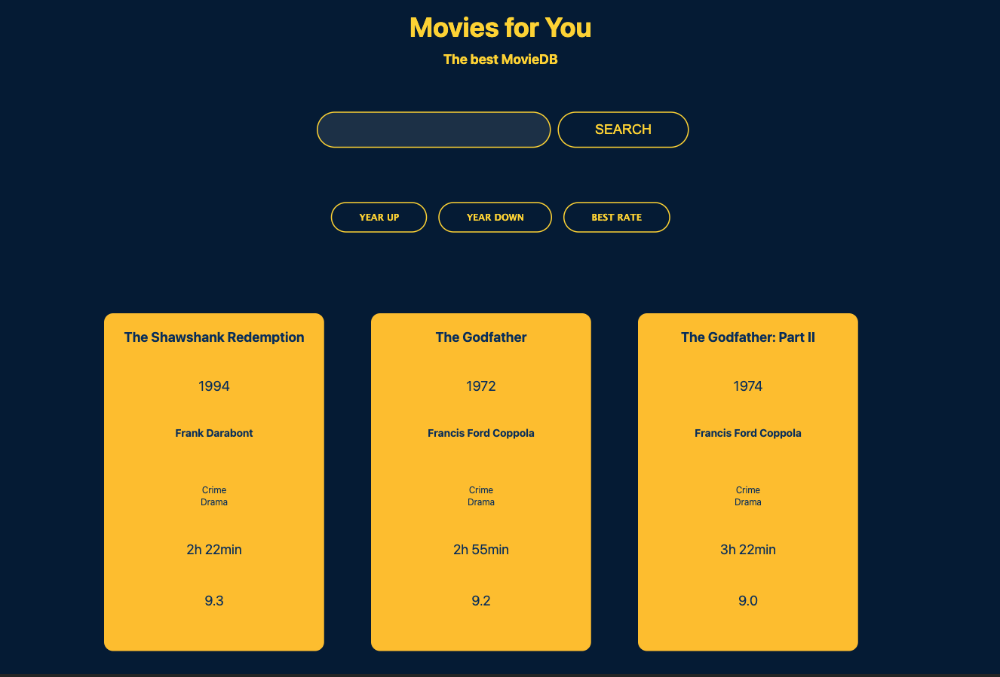

# Project Movie Database

A practical project for Supercode Fullstack Web-Dev Bootcamp.

A given Array of Movies shoud be taken as Database and a Searchengine with additional sort buttons must be added. Using Vanilla Javascript.

## Demo
You can check the result out in the following video:

https://youtu.be/xnOSmJYdP1A

## Deployment

To deploy this project click the link below

https://samuelaliyari.github.io/project-Movie-Database/

## Tech Stack

**Client:** HTML, SCSS, Javascript

**Server:** Github Pages

## Authors

- [@Samuel Aliyari](https://github.com/samuelaliyari)

## Screenshot

